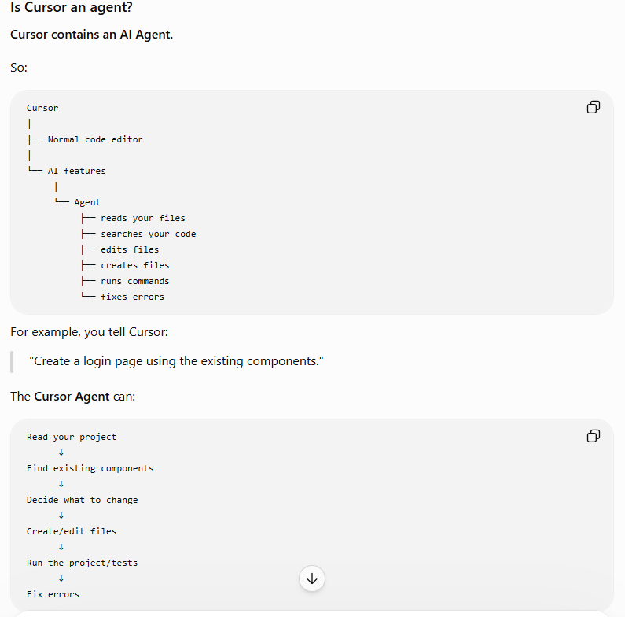

# AI
| Nm | #Question   |
| :---:   | :---: |
| 1   | [What is cursor. What is difference between cursor and AI sdk](#what-is-cursor)                                     |

1. ### what-is-cursor

Cursor = a finished car 🚗
You can drive it immediately.
AI SDK = parts/tools to build your own car 🔧
You can build something specialized for yourself.