# LIT JS
| Nm | #Question   |
| :---:   | :---: |
| 1   | [What is lit.js? What are advantages? Does it have smth like virtual dom? Some basic elements (just watch )](#lit-library)                               |
| 2   | [Is lit component html element?](#lit-html)                               |
| 3   | [Reactive properties. What does happen when property is changed? Attribute handling - its observed by default.  Supperclass propertyies. Element upgdade](#reactive-properties)                               |
| 4   | [Lifecycle methods lit](#lit-lifecycle-methods)      


when(
  condition,
  () => truthyTemplate,
  () => falsyTemplate // optional
)

1. ### lit-library
Lit is library used for building web components.
Wit lit you have more boilerplate. Lifecycle methods. Cleaner sytnax
comparison lit and virtual dom ( react )


Some basic elements,functionality of vit:


2. ### lit-html
Yes lit component is actually html element.So a Lit component inherits all of the standard HTMLElement properties and methods


3. ### reactive-properties
Reactive updates
Lit generates a getter/setter pair for each reactive property. When a reactive property changes, the component schedules an update.

```javascript
// so when you do this, comopnente is rerendered
this.title = 'New title';
```

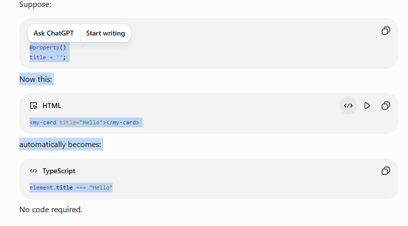

```javascript
@property({ reflect: true })
title = '';

// when you change Now:

this.title = "New";
// updates the DOM to:
<my-card title="New"></my-card>
```
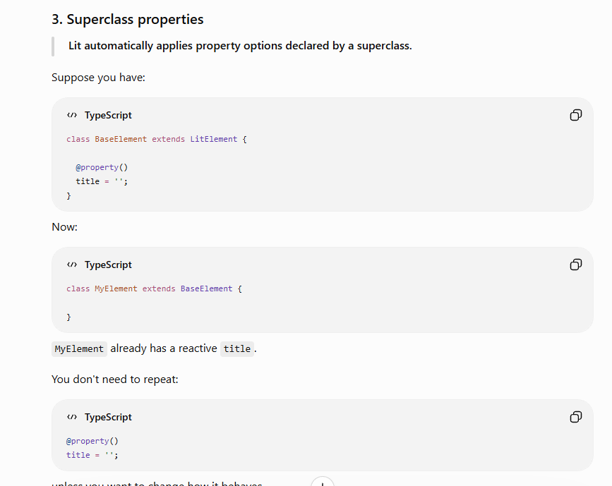

Element upgdade:

Lit guarantees that reactive properties still behave correctly even if someone assigns values before the custom element is fully defined

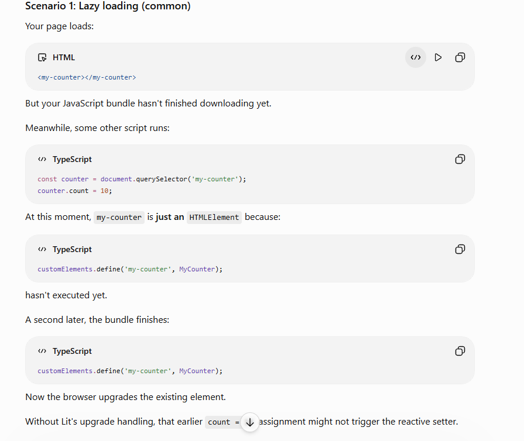


4. ### lit-lifecycle-methods
after first render:

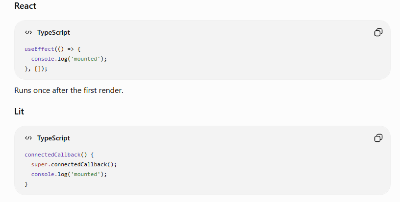

reacting on state change:
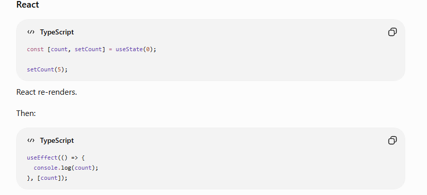
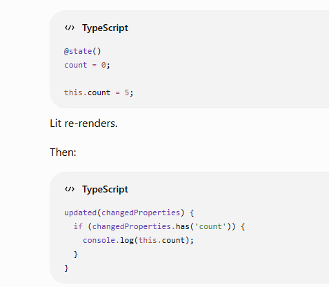
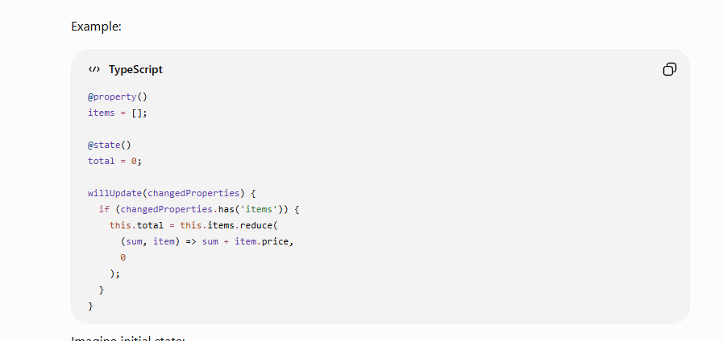
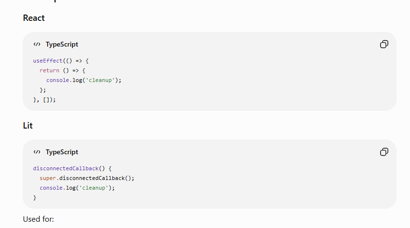

connectedCallback() and firstUpdated()
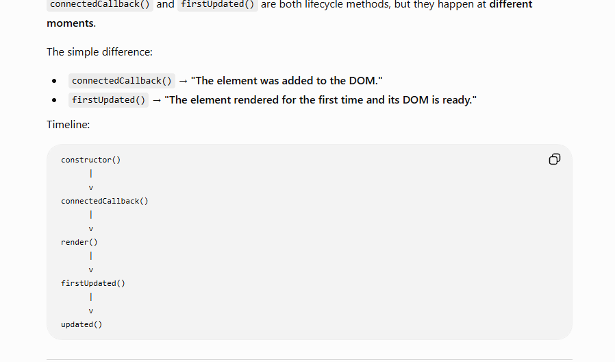

1more example
```javascript
// Example side-by-side
// React
function UserCard({id}) {
  const [user, setUser] = useState(null);

  useEffect(() => {
    fetchUser(id).then(setUser);

    return () => {
      console.log('cleanup');
    };
  }, [id]);

  return <div>{user?.name}</div>;
}
// Lit
class UserCard extends LitElement {

  @property()
  id = '';

  @state()
  user = null;

  connectedCallback() {
    super.connectedCallback();
    this.loadUser();
  }

  updated(changed) {
    if (changed.has('id')) {
      this.loadUser();
    }
  }

  disconnectedCallback() {
    super.disconnectedCallback();
    console.log('cleanup');
  }

  render() {
    return html`
      <div>${this.user?.name}</div>
    `;
  }
}
```

firstupdate / connect difference:
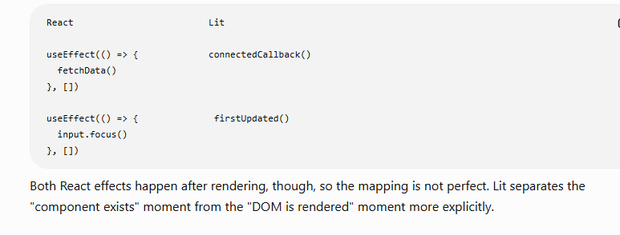

summary:

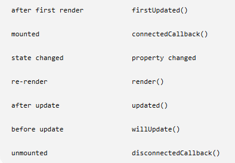
```javascript
// BASIC EXAMPLE

import {LitElement, html, css} from 'lit';
import {customElement, state, property, query} from 'lit/decorators.js';

type ToDoItem = {
  text: string,
  completed: boolean
};

@customElement('todo-list') // register component
export class ToDoList extends LitElement {
  static styles = css`
    .completed {
      text-decoration-line: line-through;
      color: #777;
    }
  `;

  @state() // state like in react 
  private _listItems = [
  { text: 'Make to-do list', completed: true },
    { text: 'Complete Lit tutorial', completed: false }
  ];
  @property() // reactive property, component isnt rerendered when we change it
  hideCompleted = false;

  render() {
    const items = this.hideCompleted
      ? this._listItems.filter((item) => !item.completed)
      : this._listItems;

    // creating html template
    const todos = html`
      <ul>
        ${items.map((item) =>
            html`
              <li
                  class=${item.completed ? 'completed' : ''}
                  @click=${() => this.toggleCompleted(item)}>
                ${item.text}
              </li>`
        )}
      </ul>
    `;
    const caughtUpMessage = html`
      <p>
      You're all caught up!
      </p>
    `;
    const todosOrMessage = items.length > 0
      ? todos
      : caughtUpMessage;

    // below directives @change to control onchange and other event handlers
    return html`
      <h2>To Do</h2>
      ${todosOrMessage}
      <input id="newitem" aria-label="New item">
      <button @click=${this.addToDo}>Add</button>
      <br>
      <label>
        <input type="checkbox"
          @change=${this.setHideCompleted}
          ?checked=${this.hideCompleted}>
        Hide completed
      </label>
    `;
  }

  toggleCompleted(item: ToDoItem) { // method to change data
    item.completed = !item.completed;
    this.requestUpdate();
  }

  setHideCompleted(e: Event) {
    this.hideCompleted = (e.target as HTMLInputElement).checked;
  }

  @query('#newitem') // its smth like query selector
  input!: HTMLInputElement;

  addToDo() {
    this._listItems = [...this._listItems,
        {text: this.input.value, completed: false}];
    this.input.value = '';
  }
}

```

```javascript
// condition rendering with Lit:

when(
  condition,
  () => truthyTemplate,
  () => falsyTemplate // optional
)
```
